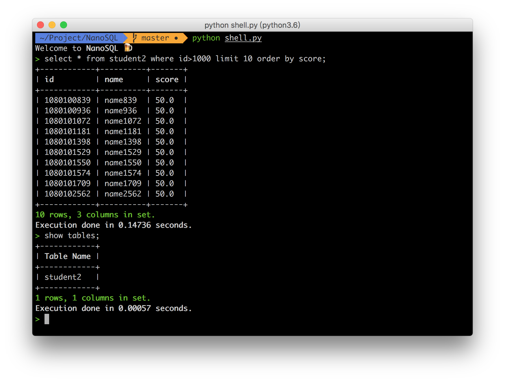

# NanoSQL



### Dependencies

- [clint](https://github.com/kennethreitz/clint) 0.5.1
- flask


The dependencies can be installed by simply use `pipenv`.

1. install pipenv.

```
pip install pipenv

```

1. install dependencies

```
pipenv install

```

1. enter virtual envirment

```
pipenv shell
```

### Run app

**Make sure currently in the pipenv or all dependencies are installed.**

#### CLI

```
python shell.py
```

#### Web

```
python web.py
```

### Sample SQLs

```sql
create table student (
  sno char(8),
  sname char(16) unique,
  sage int,
  sgender char (1),
  primary key ( sno )
);
```

```sql
create index stunameidx on student ( sname );
```

```sql
insert into student values ('12345678','wy',22,'M');
```

See more test cases at: `test/sample.txt`
