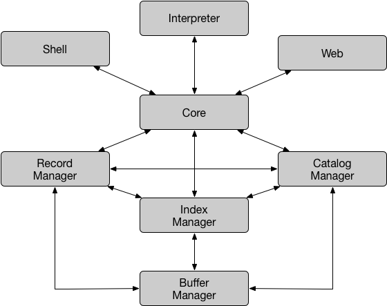

# MiniSQL实验报告

3150104894 李海鹏

3150104785 郝广博

## 项目概况


`NanoSQL`是我们使用Python语言开发的一个简易的数据库系统，支持基本的SQL操作，shell交互，图形界面访问。

项目地址：[GitHub](https://github.com/awmleer/NanoSQL)

## 分工

| 模块             | 负责   |
| -------------- | ---- |
| shell          | 郝广博  |
| interpreter    | 郝广博  |
| core           | 郝广博  |
| indexManager   | 李海鹏  |
| BPlusTree      | 李海鹏  |
| catalogManager | 李海鹏  |
| recordManager  | 李海鹏  |
| bufferManager  | 郝广博  |
| web            | 郝广博  |

## 架构说明

首先需要说明的是，我们并未完全按照实验指导书提供的模式去设计这个系统，而是自己做了一些架构上的调整。



用户和数据库系统的交互方式有两种，一种是通过shell，另一种是通过web页面，无论是那种方式，交互模块（`shell`或者`web`）所做的事情就是：把用户输入的SQL语句传送给`core`模块，把`core`返回的SQL执行结果显示给用户。

我们把`interpreter`和`core`模块独立出来了，`interpreter`只做SQL语句的解析，通过正则表达式将其解析为字典。在`core`模块拿到SQL语句后，首先通过interpreter做解析，然后再根据解析结果做分发调用。

三大数据处理模块`recordManager`、`catalogManager`、`indexManager`除了均和`core`模块、`bufferManager`有交互之外，它们之间也有少量的交互。


```
TODO
这里是各个模块的分别介绍
```


## 个人感悟

郝广博：

> 虽然NanoSQL远不能达到工业应用的标准，但麻雀虽小五脏俱全，我们在设计和制作它的过程中，体会到了数据库系统的各个模块是如何进行配合、交互的。

李海鹏：

> 本次project，是我第一次参与的严格意义上的团队项目，对团队合作开发有了一定的心得，期间也与其他组的同学有过交流，感受到人少不一定是坏事，人多不一定是好事。因为人数的增加，会导致组员之间交流成本的急剧增加，经常会导致信息不对称的后果，主要体现在模块与模块之间的对接难度之中。

> 我们使用了github代码仓库，代码改动可以随时互相更新；小组总共两位成员，对数据结构和模块之间的接口的讨论成本较低；并且有撰写说明文档的好习惯，使得我们可以将主要精力放在程序本身的代码实现之上，而没有出现其他很多小组出现的拼接各个模块困难的问题。

> 在数据库的原理方面，由于我负责的是catalog, record, index manager三个模块，十分贴近课本所学的理论知识。在模块的实现之中，深入理解了数据库底层的文件保存方式，掌握了B+Tree的原理以及使用方法，认识到python作为动态语言的优越性以及性能的不足性，并且在自己完成的NanoSQL与现有的MySQL等软件的对比之中，深切的体会到真正的SQL的复杂性，和数据库这门学科的博大精深。
